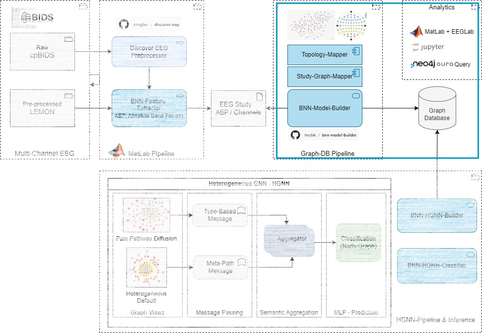
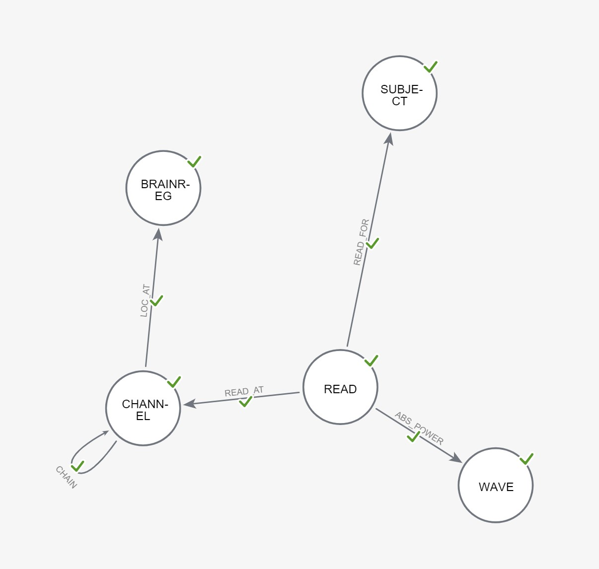
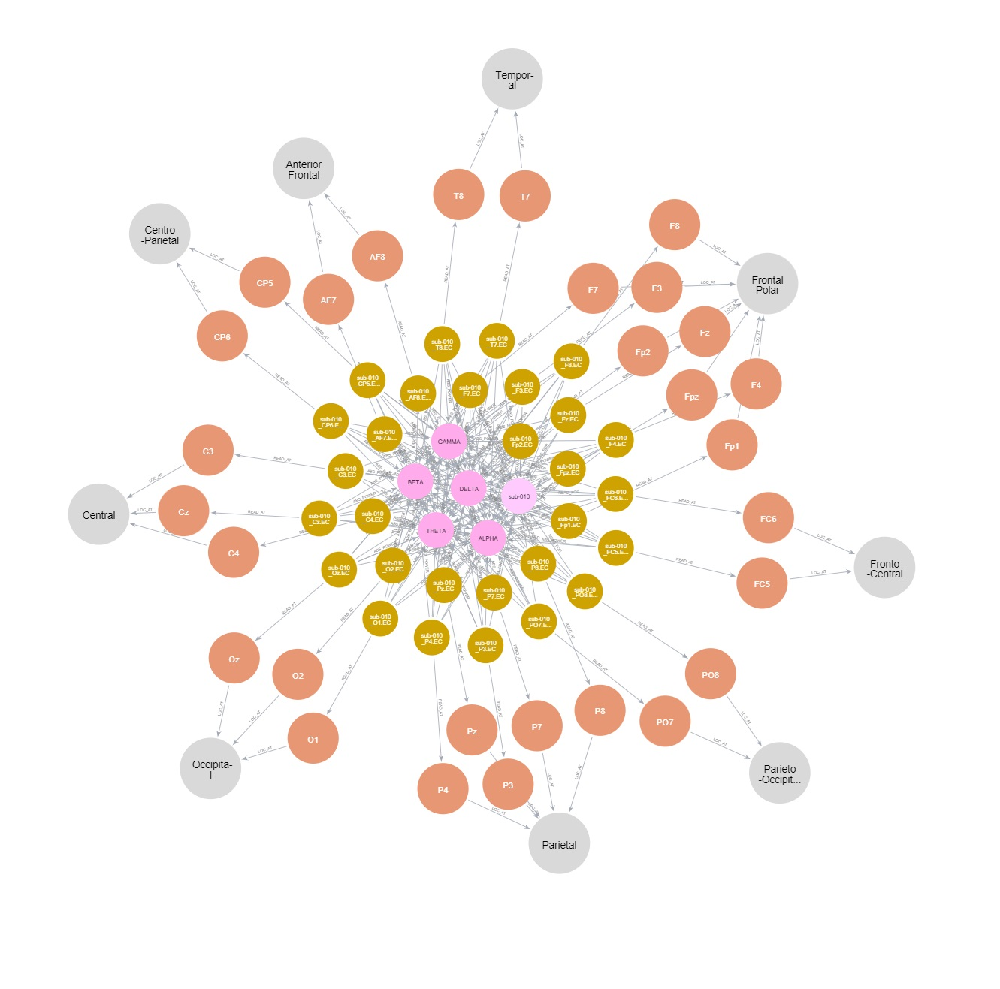

# BNN-MODEL-BUILDER
Graph model and Neo4J graph database build pipeline and utilities with preliminary analytics scripts in Cypher + Jupyter Notebook for BRAINGNNet: Graph Models for Chronic Pain Detection through EEG Biomarkers.

## Graph DB Pipeline and Tools

### Neo4J - Graph Database

Graph Database schema consists of nodes and edges covering the following subgraph components:

- **Topology-Mapper**: A subgraph capturing the *Reference Brain Topology Map* (aligning the International 10–20 system for EEG electrode placement with EEG Channel locations and labels from both cpCGX-BIDS and MBB LEMON data), along with ABP *marker* nodes for frequency bands.
- **Study-Graph-Mapper**: Subgraphs representing EEG Channel Reads clustered around the control vs. chronic pain study subjects, tying each subject to the reference brain topology and ABP to represent an activation network.

| Graph DB Schema                                              | Subject EEG Data Graph Representation                        |
| ------------------------------------------------------------ | ------------------------------------------------------------ |
|  |  |

#### Graph Database Statistics

| **NODES**                                                    | **Count** | **Property Count** | **Rel Count (Mean)** | **Rel Count (Min)** | **Rel Count (Max)** |
| ------------------------------------------------------------ | --------- | ------------------ | -------------------- | ------------------- | ------------------- |
| SUBJECT (Study Data: Participant)                            | 166       | 3                  | 89                   | 29                  | 118                 |
| BRAINREG (Ref: Brain Region)                                 | 15        | 2                  | 5                    | 1                   | 14                  |
| CHANNEL (Ref: EEG electrode position in International 10–20 system) | 73        | 10                 | 205                  | 1                   | 330                 |
| WAVE (Ref: ABS for Frequency Band - Delta, Beta, Alpha, Theta, Gamma) | 5         | 4                  | 14814                | 14814               | 14814               |
| READ (Study Data: EEG Data for Channel)                      | 14814     | 3                  | 7                    | 7                   | 7                   |

| **EDGES**                                                    | **Count** | **Property Count** |
| ------------------------------------------------------------ | --------- | ------------------ |
| LOC_AT (Ref: CHANNEL→ BRAINREG [attribute: alignment-central, right, left]) | 146       | 4                  |
| CHAIN (Ref: CHANNEL→ BRAINREG [attribute: type, right, left]) | 76        | 7                  |
| READ_FOR (Study Data: READ → SUBJECT)                        | 29628     | 3                  |
| READ_AT (Study Data: READ → CHANNEL)                         | 29628     | 3                  |
| ABS_POWER (Study Data: READ → WAVE [attr: weight-measured power]) | 148140    | 4                  |

## Preliminary Analytics & Graph DB Exploration

For a comparative analysis of Control (MBB-LEMON) and Chronic Pain (cpCGX-BIDS) Subject EEG Graphs, Cypher was used to extract base data from the Neo4J instance Graph Database, which can then be pulled into Pivot tables to create aggregations and plots using Jupyter Notebook. 

- Sample extracted Absolute Band Power stats: `test/analytics/CP-LM-Abs.csv`
- Sample Cypher queries: `./test/queries.cypher`
- Jupyter Notebook: `test/preliminary-stats.ipynb`

## Runtime Env and Dependencies

*Tested on*: Ubuntu 22.04 - *Python Version*: 3.10.12 

*Requires:* 

- Python version 3.10 or greater 
- Jupyter core packages: jupyter_core     : 5.7.2, jupyter_server   : 2.14.1jupyterlab       : 4.2.3
- Active [Neo4J - Aura](https://neo4j.com/cloud/platform/aura-graph-database/) free-tier subscription for prototype graph database access and deployment

## Utilities

Command-line options/settings are available for testing various BRAINGNNet model build/test utilities

> python main.py -h
> usage: main.py [-h] {test,build} ...
>
> BRAINGNNet Graph DB build utilities and queries
>
> positional arguments:
>   {test,build}
>     test        BRAINGNNet tester utilities for Neo4j
>     build       EEG read, channels and topology build utilities
>
> options:
>   -h, --help    show this help message and exit

+ Neo4J Access

  > usage: main.py test [-h] --neo4j [NEO4J]
  >
  > options:
  >   -h, --help       show this help message and exit
  >   --neo4j [NEO4J]  Test Neo4j connectivity

+ Build: AuraDB uploads for: 

  + Reference Topology Graph 
  + Study (Subjects and EEG Reads) Graph

  >   usage: main.py build [-h] (--topo [TOPO] | --study [STUDY] | --eegreads [EEGREADS] | --export [EXPORT])
  >
  >   options:
  >     -h, --help            show this help message and exit
  >     --topo [TOPO]         Build Ref Topology Graph
  >     --study [STUDY]       Build EEG Study Graph
  >     --eegreads [EEGREADS]       Build EEG Reads as JSON
  >     --export [EXPORT]     Export EEG Study Subgraph to CSV

## Testing

[TODO] Rudimentary unit testing to be provided via `PyTest`

## Features to Implement & Known issues

- Baseline testing for `NEO4JConnector`, and `GraphProcessor` classes
- Neo4J GIST submission

## Getting help

If you have questions, concerns, bug reports, etc, please file an issue in this repository's Issue Tracker.

## Open source licensing info

1. [LICENSE](LICENSE)

----

## Credits and References

### EEG Study Datasets

The graph model in this repository was build to assess the effectiveness of a HGNN learner and inference framework aligning the brain topology with the International 10–10 system for EEG electrode placement and Absolute Band Powers as the key EEG feature. 

This model combines Brain Imaging Data Structure (BIDS) compliant datasets from two critical EEG studies:

- **cpCGX-BIDS: Chronic Pain Data EEG Dataset** (Technical University of Munich [Zebhauser])

  - Raw resting-state EEG data [conditions: eyes closed (EC) or eyes open(EO), Electrodes: 29] in BIDS format for 74 chronic pain patients
  - Recorded between March 2022 and November 2022 in the Klinikum Rechts der Isar (Munich, Germany)

  *More At*: https://doi.org/10.1038/s41597-023-02525-0

- **MBB LEMON: Control (Healthy) EEG Dataset** (Max Planck Institut Leipzig [Babayan])

  - Preprocessed resting state EEG data [conditions: eyes closed (EC) or eyes open(EO), Electrodes: 59] in BIDS format for 228 Participants (from which we sampled 92). 
  - Digitized EEG channel locations Polhemus leveraging PATRIOT Motion Tracking System (Polhemus, Colchester, VT, USA) localizer with the Brainstorm toolbox.

  *More At*: https://fcon_1000.projects.nitrc.org/indi/retro/MPI_LEMON.html

### EEG Data Preprocessing 

#### [DISCOVER-EEG](https://github.com/crisglav/discover-eeg?tab=readme-ov-file#discover-eeg-an-eeg-pipeline-for-biomarker-discovery)

> An open, fully automated EEG pipeline for biomarker discovery in clinical neuroscience, for preprocessing, analyzing and visualizing resting state EEG data in Matlab using EEGLab and FieldTrip toolboxes [accompanying publication in Scientific Data](https://www.nature.com/articles/s41597-023-02525)))

### Other References

Following resources were referenced in developing the EEG 10-20 System based topology mappings:

1. Malmivuo, Jaakko & Plonsey, Robert. (1995). Bioelectromagnetism. 13. Electroencephalography. 

   https://www.bem.fi/book/13/13.htm#03

2. An introduction to EEG for students in the health professions, including medical students, neurology residents, and students of EEG technology.

   https://www.youtube.com/watch?v=XMizSSOejg0

3. EEG 10-20 System 

   https://www.kaggle.com/code/seshurajup/eegs-10-20-system/notebook#Why-it-called-10-20-system-?

   
